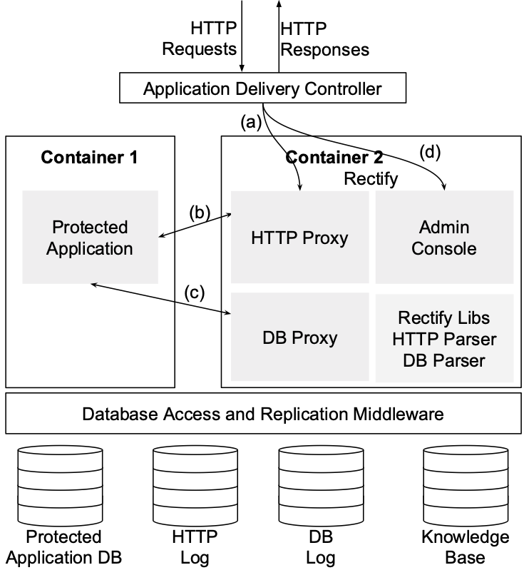
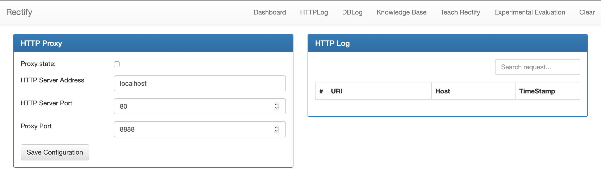

# Rectify: Black-Box Intrusion Recovery in PaaS Clouds

Rectify is a new approach to recover from intrusions on applications running in a PaaS. It is a service designed to be deployed alongside the application in a PaaS container.
without requiring modifications to the software and the recovery can be performed by a system administrator. Machine learning techniques are used to associate the requests received by the application to the statements issued to the database.
The statements issued in result of malicious requests can be  identified and  their effects  reversed under control of the administrator.



For more information regarding Rectify please visit http://www.gsd.inesc-id.pt/~dmatos/publication/rectify/ 


## Getting Started

The following instructions will help you get started with a local deployment of Rectify with a Wordpress application as the protected application.

### Prerequisites

Rectify was built using Maven and Docker. Make sure you have both installed before continuing.


### Installing

First build Rectify by executing

```
mvn war:war
```

Then start Rectify with a WordPress application using the following command:

```
docker-compose up
```

The following table describes the addresses the services started by the docker-compose command:

| Service Name          | Port | Address                                  |
|-----------------------|------|------------------------------------------|
| Rectify Admin Console | 8080 | http://localhost:8080/rectify            |
| Rectify Database      | 3306 | jdbc:mysql://rectify_db:3306/rectify     |
| Wordpress Application | 8081 | http://localhost:8081                    |
| Wordpress Database    | 3307 | jdbc:mysql://wordpress_db:3307/wordpress |





## Built With

* [Maven](https://maven.apache.org/) - Dependency Management
* [Wordpress](https://wordpress.org) - The protected application
* [MySQL](https://www.mysql.com) - Dependency Management
* [Docker](https://www.docker.com) - For deployment
* [Tomcat](http://tomcat.apache.org) - The application server used for Rectify


## Authors

* **David Matos** - *Development of the system* - [Github](https://github.com/davidmatos)


## License

This project is licensed under the MIT License - see the [LICENSE.md](LICENSE.md) file for details

## Acknowledgments

* **[Prof. Miguel Pardal](https://github.com/miguelpardal)**  - CoAuthor of the article
* **[Prof. Miguel Correia](https://github.com/mpcorreia)**  - CoAuthor of the article

